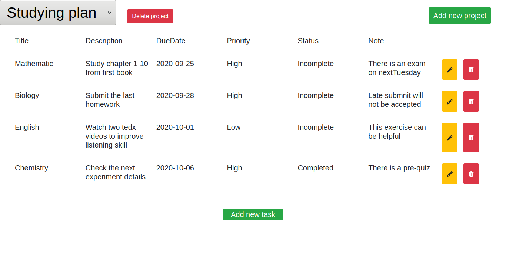

# Task-list

In this project, we built a simple Todo App using Webpack and ES6 by dynamically creating a majority of the DOM elements. Local storage was used to persist data across the user's session.

- DOM Manipulation with JavaScript
- LocalStorage
- Bootstrap
- Jest Testing



View the app live [here](https://raw.githack.com/somoye123/task-list/main-part/dist/index.html)

## Built With

- Javascript
- HTML
- CSS

## Getting Started

To get a local copy of the repository please run the following commands on your terminal:

```bash
$ cd <folder>
$ git clone https://github.com/acushlakoncept/todo.git
$ cd todo
$ npm install
$ npm run start
```

### Prerequisites

- Get a browser like Chrome and Firefox in their most recent versions

### Install

- Install VSCode or any code editor you like

#### Run test
```bash
$ npm test
```

# Authors

👤 **Hasan Özovalı**

- Github: [@ozovalihasan](https://github.com/ozovalihasan)
- Twitter: [@ozovalihasan](https://twitter.com/ozovalihasan)
- LinkedIn: [Hasan Ozovali](https://www.linkedin.com/in/hasan-ozovali/)
- Mail: [ozovalihasan@gmail.com](ozovalihasan@gmail.com)

👤 **Somoye Ayotunde**

- Github:[@somoye123](https://github.com/somoye123)
- Twitter:[@ayotunde_197](https://twitter.com/ayotunde_197)
- LinkedIn:[Somoye Ayotunde](https://www.linkedin.com/in/somoye-ayotunde-03a471161)
- Mail: [somoye.ayotunde@gmail.com](somoye.ayotunde@gmail.com)

## 🤝 Contributing

Contributions, issues and feature requests are welcome!

Feel free to check the [issues page](https://github.com/somoye123/task-list/issues).

## Acknowledgments

Thanks to [Microverse](https://www.microverse.org/) for support

## Show your support

Give a ⭐️ if you like this project!
